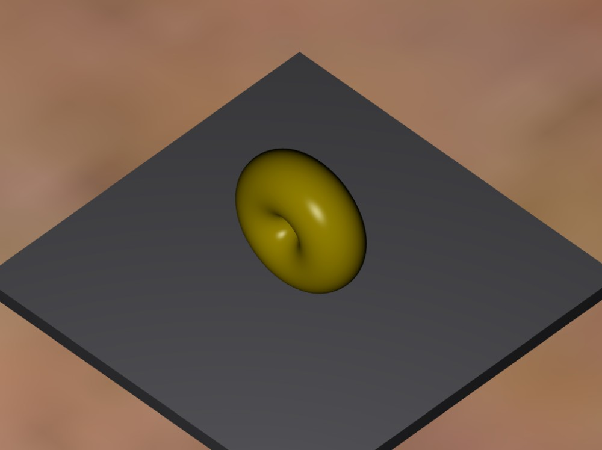
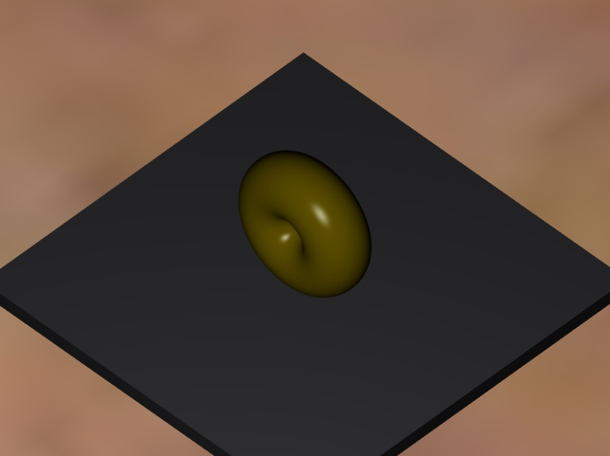
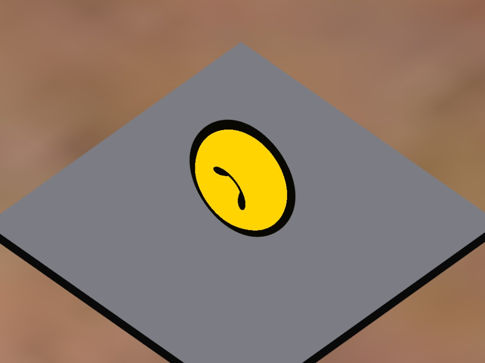
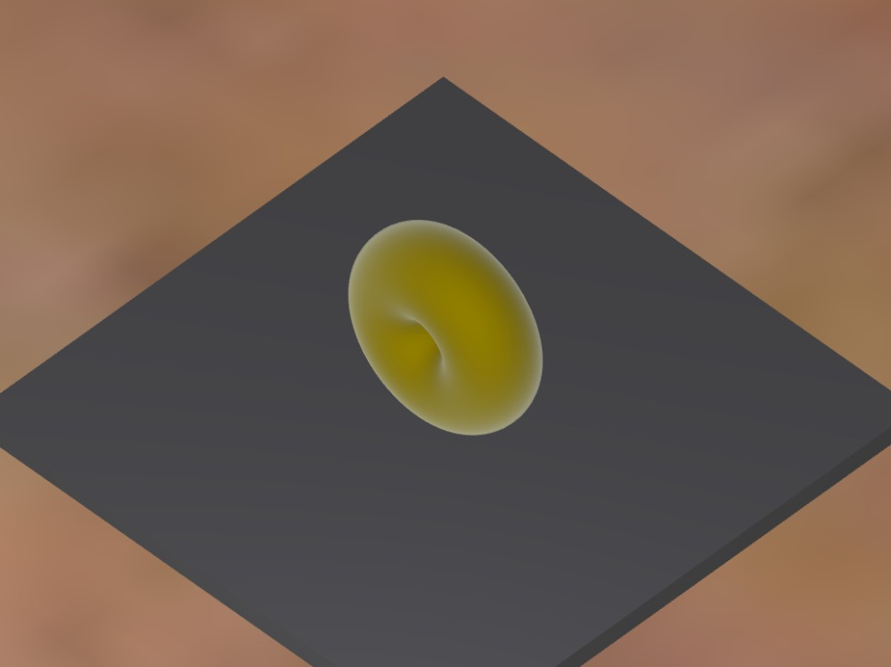

# WebGL Shader Playground

Real-time shading model explorer built directly on the WebGL API — no Three.js,
no rendering framework. Nine shading models, a cubemap environment, and a
fixed-timestep physics drop, driven from a live control panel.

**[▶ Open the live demo](https://dollars7.github.io/WebGL-Shader-Playground/)**



---
## Technical Highlights

Built entirely on raw WebGL 1.0 — no Three.js, no rendering framework. Every part of
the pipeline is hand-written:

- 9 custom GLSL fragment shaders (Phong, Fresnel, toon, procedural materials)
- Real-time Blinn-Phong lighting computed per-pixel
- Cubemap reflections
- Parametric mesh generation

Skipping Three.js was deliberate — the goal was to actually understand the WebGL
pipeline (buffers, shader compilation, uniform/attribute wiring, render loop) rather
than delegate it to a library.

## Background

This started as a computer graphics course assignment: a working renderer, but
written the way coursework tends to be — one 1300-line `app.js` with 100+
globals, all nine shading models packed into a single 400-line `if/else` chain
inside a `<script>` tag, and the cubemap shipped as six ~500KB JavaScript files
that each assigned a base64 data URL to a global. No build step, no modules, no
tests.

It was rewritten to find out what the same project looks like built properly.
The rendering ideas carried over; nearly everything about how they were
organised did not.

|                     | Before | After                             |
| ------------------- | -----: | --------------------------------- |
| Largest source file |  1300 lines | 260 lines                    |
| Largest shader file |   400 lines | ~30 lines each                |
| Global variables    |   100+ | 0                                 |
| Tests               |      0 | 38                                |
| Build / CI          |   none | Vite, lint + test + deploy on push |

The original is still runnable under [`legacy/`](legacy/) for comparison.

Along the way the rewrite surfaced real bugs in the original — torus indices
that connected vertices across unrelated rings, and vase normals computed as
`radius - yRatio * height`, which adds two different units and lights the
surface as if it were a different shape.

---

## Screenshots

| Chrome | Toon | Fresnel |
| ------ | ---- | ------- |
|  |  |  |

---

## Architecture

```
src/
├── core/         WebGL context, shader compilation, buffers, frame loop
├── graphics/     camera, material, lighting, skybox, matrix math, physics
├── geometry/     torus, surface-of-revolution vase, sphere, box
├── shaders/      one .frag per model + shared lib/
└── ui/           DOM events
```

---

## Implementation notes

Three decisions that were not obvious going in.

### GLSL gets a real `#include`

GLSL ES 1.0 has no preprocessor include, so shared helpers would have to be
copy-pasted across nine fragment shaders. `ShaderManager.resolveIncludes()`
inlines them instead:

```glsl
#include "lib/tonemap.glsl"
```

Paths resolve relative to the including file, and each file is inlined at most
once per program — which avoids redefinition errors and terminates any
accidental include cycle. Sources come from `import.meta.glob(…, { query:
'?raw' })` rather than `fetch`, so a missing shader fails the build instead of
the page, and the deployed app makes no extra requests for them.

### Tone mapping, so the intensity slider does something

Gold's diffuse colour is `(1.0, 0.8, 0.0)`. At 100% intensity the red channel
has already reached 1.0, so the driver hard-clamps everything beyond it and the
whole upper half of the Intensity slider is mathematically a no-op.

Extended Reinhard (`WHITE_POINT = 3.0`) keeps dim values essentially linear and
rolls highlights off smoothly, which makes the full range usable.

### Physics that doesn't depend on frame rate

The drop integrates on a fixed 1/120s step with an accumulator. A per-frame
delta would make restitution frame-rate dependent — the same drop would settle
differently at 60Hz and 144Hz. Penetration is corrected *before* the velocity is
reflected, otherwise a slow object stays below the surface and flips its
velocity again on the next step.

Rebound heights, measured against the analytic solution:

| rebound       | 1     | 2     | 3     | 4     |
| ------------- | ----- | ----- | ----- | ----- |
| height        | 0.902 | 0.574 | 0.361 | 0.225 |
| ratio to prev | —     | 0.636 | 0.630 | 0.622 |

Expected ratio is `e² = 0.64` for a restitution of 0.8.

<details>
<summary>Other things worth a look</summary>

- **Skybox is a fullscreen pass, not a cube.** Each pixel reconstructs its view
  direction through `inverse(projection × viewWithoutTranslation)` and samples
  the cubemap along it — no cube geometry, and the background cannot clip
  against the model. It runs after the scene at depth 1.0 with `LEQUAL`, so it
  only shades pixels the geometry didn't claim.
- **Vase normals come from the surface derivative.** Its profile is a
  Catmull-Rom spline through nine control radii; normals are the cross product
  of the two surface tangents, with the profile derivative taken by central
  difference — so changing the silhouette needs no hand-derived normal.
- **Assets are decoded, not embedded.** `scripts/decode-skybox.js` turns the six
  base64 JavaScript files back into PNGs (3.0MB → 2.2MB) that the browser
  fetches in parallel and caches normally.

</details>

---

## Shading models

| Model     | Technique                                       |
| --------- | ----------------------------------------------- |
| Phong     | Blinn-Phong with a half-vector specular term     |
| Clay      | Lambertian diffuse only                          |
| Ceramic   | Narrowed specular exponent, attenuated highlight |
| Pearl     | Full-strength specular                           |
| Chrome    | Suppressed diffuse, sharpened specular           |
| Fresnel   | View-angle dependent rim term                    |
| Toon      | Quantized diffuse via `step()`                   |
| Hologram  | Time-driven scanlines and pulse                  |
| Normal    | Surface normals remapped to RGB, for debugging   |

Adding one takes three steps and no changes to existing code: drop in
`src/shaders/yourmodel.frag`, add it to the preset list in `ShaderManager.js`,
and add a button carrying the matching `data-shader` attribute.

---

## Development

```bash
npm install
npm run dev      # http://localhost:3000
npm test         # 38 tests
npm run build    # → dist/
```

Tests cover what is slow and unreliable to check by staring at a running
renderer: normals unit-length and outward-facing, indices in range for a
`UNSIGNED_SHORT` buffer, no degenerate triangles, projection matrices mapping to
the canonical view volume, `inverse` round-tripping, and the physics settling
identically at 60Hz and 144Hz. They have already earned their keep — the suite
caught `update()` failing to re-check `running` inside its substep loop, which
fired the settle callback twice.

Pushes to `main` run lint, tests, and a build, then publish to GitHub Pages.
`/shader-playground/` forwards to the site root, since that path is linked
externally and has to keep resolving.

Requires WebGL 1.0; uses WebGL 2.0 when available.
